# NBA Stats

A modern, cloud-native web application to display real-time NBA statistics with a React frontend, Node.js API backend, and PostgreSQL database. Designed for Azure deployment with full Infrastructure as Code (IaC) using Bicep.

## Features

✅ **Database-First Architecture** - PostgreSQL caches all API responses, dramatically reducing external API calls  
✅ **Rate Limit Protection** - Database caching prevents hitting BallDontLie's 5 requests/minute limit  
✅ **Fast Performance** - Data served from local database is much faster than external API calls  
✅ **Automatic Data Sync** - First request fetches from BallDontLie and stores in DB, subsequent requests use cached data  
✅ **Real NBA Data** - Teams, Players, Games from the official BallDontLie API  
✅ **Cloud-Ready** - Fully automated Azure deployment with Bicep IaC and Azure DevOps pipelines  
✅ **Azure Developer CLI** - One-command deployment with `azd up`  

## Architecture


**Data Flow:**
1. Frontend requests data (e.g., teams)
2. API checks in-memory cache first
3. If cache miss → check PostgreSQL database
4. If data exists in DB → return immediately (fast!)
5. If data missing → fetch from BallDontLie API → store in DB → return to frontend
6. Subsequent requests use cached database data (no external API call!)

## Quick Start

### Local Development (Docker)

#### Prerequisites
- Docker & Docker Compose
- **BallDontLie API Key** - Get yours at [https://www.balldontlie.io](https://www.balldontlie.io)

#### Setup

1. **Get your BallDontLie API Key:**
   - Visit [https://www.balldontlie.io](https://www.balldontlie.io)
   - Sign up and get your API key from the dashboard

2. **Add your API key to `.env`:**
   ```bash
   # Edit the .env file in the root directory
   NBA_API_KEY=your_actual_api_key_here
   ```

3. **Start the application:**
   ```bash
   docker-compose up
   ```
   
   Or run in detached mode:
   ```bash
   docker-compose up -d
   ```

The application will be available at:
- **Frontend**: http://localhost:3001
- **API**: http://localhost:3000/api/v1
- **API Health Check**: http://localhost:3000/api/health

### Azure Deployment (Azure Developer CLI)

Deploy the entire application to Azure with a single command using [Azure Developer CLI (azd)](https://learn.microsoft.com/azure/developer/azure-developer-cli/overview).

#### Prerequisites
- [Azure Developer CLI (azd)](https://learn.microsoft.com/azure/developer/azure-developer-cli/install-azd)
- Azure subscription
- **BallDontLie API Key** - Get yours at [https://www.balldontlie.io](https://www.balldontlie.io)

#### Quick Deploy

```bash
# Login to Azure
azd auth login

# Initialize environment (one-time setup)
azd env new dev
azd env set AZURE_LOCATION swedencentral

# Deploy everything
azd up
```

The `azd up` command will prompt you for:
- Azure subscription (if not already set)
- NBA API key
- PostgreSQL admin password

**💡 Tip:** Always run `azd env set AZURE_LOCATION <region>` after creating a new environment to avoid deployment errors.

That's it! `azd up` will:
1. ✅ Create Azure resources (Container Apps, PostgreSQL, Key Vault, etc.)
2. ✅ Build and deploy your containers
3. ✅ Configure networking and security
4. ✅ Initialize the database
5. ✅ Provide you with the application URL

#### Other azd Commands

```bash
# Deploy code changes only (no infrastructure changes)
azd deploy

# Provision infrastructure only (no deployment)
azd provision

# Monitor application
azd monitor

# View application endpoints
azd show

# Clean up all Azure resources
azd down
```

### Manual Azure Deployment (Bicep)

If you prefer manual control over infrastructure deployment, use the Bicep scripts directly.

#### Prerequisites
- [Azure CLI](https://learn.microsoft.com/cli/azure/install-azure-cli)
- Azure subscription
- **BallDontLie API Key**

#### Deploy

```bash
# Login to Azure
az login

# Navigate to infrastructure directory
cd infra

# Deploy to dev environment
./scripts/deploy.sh dev

# Or run what-if analysis first
./scripts/deploy.sh dev --what-if
```

See [`infra/README.md`](infra/README.md) for detailed infrastructure documentation.

### Verify the Setup

Test that the BallDontLie API integration is working:

```bash
# Check API health
curl http://localhost:3000/api/health

# Get NBA teams (should return real data)
curl http://localhost:3000/api/v1/teams

# Get NBA players
curl "http://localhost:3000/api/v1/players?limit=5"
```

If you get real NBA data, you're all set! 🏀

## Available Services

| Service | Port | URL | Purpose |
|---------|------|-----|---------|
| Frontend | 3001 | http://localhost:3001 | React web application |
| API | 3000 | http://localhost:3000/api/v1 | REST API server |
| PostgreSQL | 5432 | localhost:5432 | Database |

## API Endpoints

### Teams
- `GET /api/v1/teams` - Get all NBA teams
- `GET /api/v1/teams/:id` - Get specific team by ID

### Players
- `GET /api/v1/players` - Get all NBA players (paginated)
  - Query params: `cursor`, `limit`, `search`
- `GET /api/v1/players/:id` - Get specific player by ID

### Games
- `GET /api/v1/games` - Get NBA games (with filters)
  - Query params: `dates`, `seasons`, `team_ids`, `cursor`, `limit`
- `GET /api/v1/games/:id` - Get specific game by ID

## Project Structure

```
nba-stats/
├── frontend/              # React + TypeScript + Vite
│   ├── src/              # Source code
│   ├── Dockerfile        # Container image for Azure deployment
│   └── nginx.conf        # Production web server config
├── services/
│   └── api/              # Express.js API server
│       ├── src/          # Source code
│       ├── Dockerfile    # Container image for Azure deployment
│       └── openapi/      # API specification
├── infra/                # Infrastructure as Code (Bicep)
│   ├── main.bicep        # Main orchestration (subscription-level)
│   ├── modules/          # Reusable Bicep modules
│   ├── parameters/       # Environment-specific configs (dev/test/prod)
│   ├── scripts/          # Deployment and utility scripts
│   └── docs/             # Infrastructure documentation
├── pipelines/            # Azure DevOps CI/CD pipelines
│   └── infra-deploy.yml  # Infrastructure deployment pipeline
├── azure.yaml            # Azure Developer CLI configuration
├── docker-compose.yml    # Local development setup
└── tests/                # Test suites
```

## Deployment Options

This project supports three deployment approaches:

### 1. 🚀 Azure Developer CLI (Recommended for Quick Starts)
```bash
azd up  # One command to deploy everything
```
- **Best for**: Getting started quickly, proof of concepts
- **Pros**: Simplest, fastest, handles everything
- **Cons**: Less control over individual steps

### 2. 🏗️ Azure DevOps Pipelines (Recommended for Production)
- **Best for**: Team environments, production workloads
- **Pros**: Full CI/CD, approval gates, what-if analysis, audit trail
- **Cons**: Requires Azure DevOps setup
- **Location**: See `pipelines/infra-deploy.yml`

### 3. 🔧 Manual Bicep Deployment
```bash
cd infra && ./scripts/deploy.sh dev
```
- **Best for**: Learning, troubleshooting, custom workflows
- **Pros**: Full control, educational
- **Cons**: Manual process, no automation

## Azure Architecture

The application uses **subscription-level Bicep deployment** to manage the complete infrastructure lifecycle, including resource groups. Default deployment location is **Sweden Central** (can be changed in parameter files).

```mermaid
graph TB
    subgraph Internet["🌐 Internet"]
        Users["👥 Users"]
    end

    subgraph Azure["☁️ Azure Subscription"]
        subgraph RG["📦 Resource Group"]
            subgraph VNet["🔒 Virtual Network"]
                subgraph ContainerSubnet["Container Apps Subnet"]
                    CAEnv["🐳 Container Apps Environment"]
                    Frontend["⚛️ Frontend App<br/>(React)"]
                    API["🔧 API App<br/>(Node.js)"]
                end
                
                subgraph DBSubnet["Database Subnet"]
                    PostgreSQL["🗄️ PostgreSQL<br/>Flexible Server"]
                end
                
                subgraph PrivateSubnet["Private Endpoints Subnet"]
                    KVPE["🔐 Key Vault PE"]
                end
            end
            
            ACR["📦 Container Registry"]
            KV["🔑 Key Vault"]
            LogWS["📊 Log Analytics"]
            AppInsights["📈 App Insights"]
            Identity["🎫 Managed Identity"]
        end
    end
    
    subgraph External["🌍 External Services"]
        BallDontLie["🏀 BallDontLie API"]
    end

    Users -->|HTTPS| Frontend
    Frontend -->|API Calls| API
    API -->|Query/Store| PostgreSQL
    API -->|Fetch NBA Data| BallDontLie
    API -->|Get Secrets| KV
    Frontend -.->|Logs| LogWS
    API -.->|Logs| LogWS
    API -.->|Telemetry| AppInsights
    Frontend -.->|Telemetry| AppInsights
    CAEnv -->|Pull Images| ACR
    API -->|Uses| Identity
    Identity -->|Access| KV

    style Users fill:#61dafb,stroke:#333,stroke-width:2px
    style Frontend fill:#61dafb,stroke:#333,stroke-width:2px
    style API fill:#68a063,stroke:#333,stroke-width:2px
    style PostgreSQL fill:#336791,stroke:#333,stroke-width:2px
    style KV fill:#ffd93d,stroke:#333,stroke-width:2px
    style ACR fill:#0078d4,stroke:#333,stroke-width:2px
    style CAEnv fill:#00bcf2,stroke:#333,stroke-width:2px
    style BallDontLie fill:#ff6b6b,stroke:#333,stroke-width:2px
    style LogWS fill:#00a2ed,stroke:#333,stroke-width:2px
    style AppInsights fill:#773fbd,stroke:#333,stroke-width:2px
    style Identity fill:#50e6ff,stroke:#333,stroke-width:2px
```



### Azure Resources Created

| Resource | Purpose | SKU/Tier |
|----------|---------|----------|
| Resource Group | Logical container for all resources | N/A |
| Virtual Network | Network isolation and segmentation | Standard |
| Container Apps Environment | Hosts containerized apps | Consumption |
| Container Apps (2) | Frontend and API services | Consumption |
| PostgreSQL Flexible Server | Database for caching NBA data | Burstable B1ms (dev) |
| Azure Container Registry | Stores container images | Basic |
| Key Vault | Secrets management | Standard |
| Log Analytics Workspace | Centralized logging and monitoring | Per GB |
| User Assigned Identity | Managed identity for secure access | N/A |

### Environments

| Environment | Resource Group | Purpose | Deployment |
|-------------|---------------|---------|------------|
| **Dev** | `rg-nba-stats-dev` | Development and testing | Automatic via push to `main` |
| **Test** | `rg-nba-stats-test` | Pre-production validation | Manual approval required |
| **Prod** | `rg-nba-stats-prod` | Production workloads | Manual approval + destructive change guard |

### Key Features

✅ **Subscription-Level Deployment** - Bicep manages resource groups (true IaC)  
✅ **Environment Parity** - Identical infrastructure across dev/test/prod  
✅ **Security Best Practices** - Key Vault for secrets, managed identities, private endpoints (test/prod)  
✅ **High Availability** - Zone redundancy in production  
✅ **Cost Optimization** - Right-sized SKUs per environment  
✅ **Automated Deployments** - What-if analysis, approval gates, destructive change detection

## Development

### Frontend Development
```bash
cd frontend
npm install
npm run dev
```

### API Development
```bash
cd services/api
npm install
npm run dev
```

## Technology Stack

### Frontend
- **React 19** - UI framework
- **TypeScript** - Type safety
- **Vite** - Build tool and dev server
- **Tailwind CSS** - Utility-first CSS
- **React Router** - Client-side routing

### Backend
- **Node.js** - Runtime
- **Express.js** - Web framework
- **PostgreSQL** - Database (with flexible server on Azure)
- **In-Memory Cache** - 5-minute TTL for optimal performance

### Infrastructure & DevOps
- **Bicep** - Infrastructure as Code (subscription-level deployment)
- **Azure Container Apps** - Serverless container hosting
- **Azure Container Registry** - Container image storage
- **Azure Key Vault** - Secrets management
- **Azure DevOps** - CI/CD pipelines with approval gates
- **Azure Developer CLI (azd)** - Simplified deployment workflow
- **Docker** - Containerization for local dev and Azure deployment
- **Nginx** - Production web server for frontend

### External Services
- **BallDontLie.io API** - NBA statistics data source

## Features

- ✅ **Real NBA Data**: Integrated with BallDontLie.io API
- ✅ **Players**: Browse and search NBA players
- ✅ **Teams**: View all NBA teams with details
- ✅ **Games**: Access game schedules and results
- ✅ **Smart Caching**: Database + in-memory cache (5-minute TTL) to optimize API calls
- ✅ **Cloud-Native**: Fully containerized and Azure-ready
- ✅ **Infrastructure as Code**: Complete Bicep templates for reproducible deployments
- ✅ **CI/CD**: Azure DevOps pipelines with what-if analysis and approval gates
- ✅ **Comprehensive Error Handling**: Robust error handling and centralized logging

## Development

### Local Development (without Docker)

**Frontend:**
```bash
cd frontend
npm install
npm run dev
# Runs on http://localhost:5173
```

**API:**
```bash
cd services/api
npm install
npm run dev
# Runs on http://localhost:3000
```

**Database:**
You'll need a PostgreSQL instance running. Use Docker:
```bash
docker run --name postgres \
  -e POSTGRES_PASSWORD=yourpassword \
  -e POSTGRES_DB=nba_stats \
  -p 5432:5432 \
  -d postgres:15
```

### Stopping the Application

**Docker Compose:**
```bash
docker-compose down
```

**Azure:**
```bash
# Remove all Azure resources
azd down

# Or use Azure Portal to delete resource group
```

## Troubleshooting

### Common Issues

**401 Unauthorized Error**
- Make sure you've added your API key to the `.env` file (local) or Azure Key Vault (Azure)
- Verify your API key is valid at https://www.balldontlie.io

**No Data Showing**
- **Local**: Check that Docker containers are running: `docker-compose ps`
- **Azure**: Check Container Apps logs in Azure Portal or via `azd monitor`
- View API logs: `docker-compose logs api` (local) or Azure Portal (cloud)
- Restart containers: `docker-compose restart` (local)

**Port Already in Use (Local)**
- Check if ports 3000 or 3001 are in use
- Modify ports in `docker-compose.yml` if needed

**Azure Deployment Issues**
- Run what-if analysis: `./infra/scripts/deploy.sh dev --what-if`
- Check Azure DevOps pipeline logs for detailed error messages
- Verify service connections are configured in Azure DevOps
- Ensure you have proper Azure RBAC permissions

**Resource Group Already Exists**
- The Bicep templates now use subscription-level deployment
- Resource groups are created and managed by Bicep
- Delete manually created resource groups and let Bicep recreate them

**Key Vault Name Conflict**
- If you get a "VaultAlreadyExists" error, the Key Vault is soft-deleted
- Dev/Test environments: Purge protection is disabled, run `az keyvault purge --name <vault-name>`
- Production: Purge protection is enabled (7-day retention), wait or use a different name
- **Missing location error**: If you get "location property must be specified", run: `azd env set AZURE_LOCATION swedencentral`
- To clean up and redeploy: `azd down` then `az keyvault purge --name <vault-name>` then `azd up`

## Documentation

- **[Infrastructure Guide](infra/README.md)** - Detailed Bicep and deployment documentation
- **[Azure Developer CLI Integration](infra/docs/AZD_INTEGRATION.md)** - azd deployment guide
- **[Service Connection Setup](infra/docs/SERVICE_CONNECTION.md)** - Azure DevOps configuration
- **[Frontend Architecture](frontend/ARCHITECTURE.md)** - React application structure
- **[API Schemas](services/api/schemas.md)** - API data models and validation
- **[API Error Handling](services/api/ERROR_HANDLING.md)** - Error handling patterns
- **[OpenAPI Specification](services/api/openapi/v1.yml)** - Complete API documentation

## Contributing

1. Fork the repository
2. Create a feature branch: `git checkout -b feature/your-feature`
3. Make your changes
4. Test locally with Docker Compose
5. Test Azure deployment: `azd up` or use the manual Bicep deployment
6. Commit your changes: `git commit -am 'Add your feature'`
7. Push to the branch: `git push origin feature/your-feature`
8. Create a Pull Request

## License

ISC
