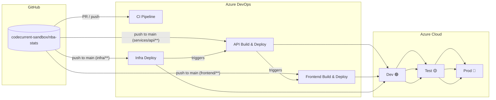
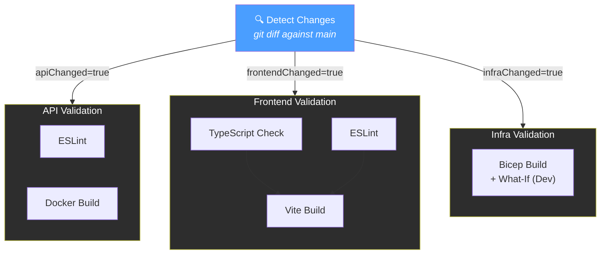
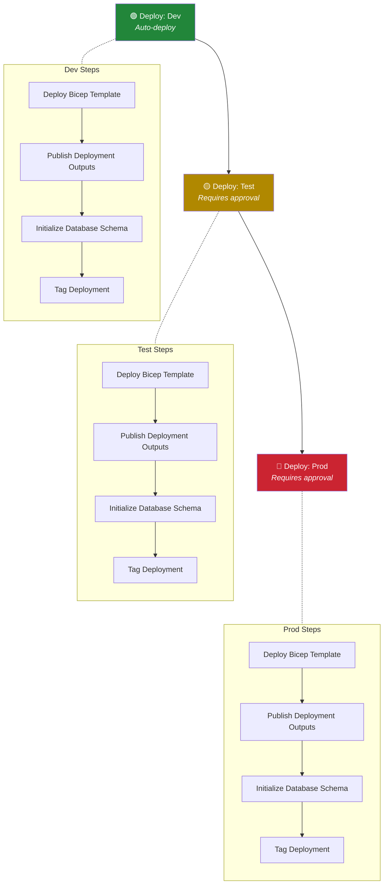
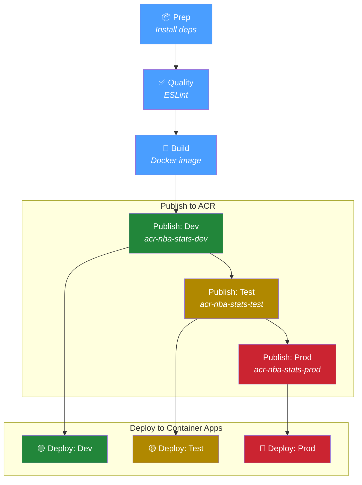
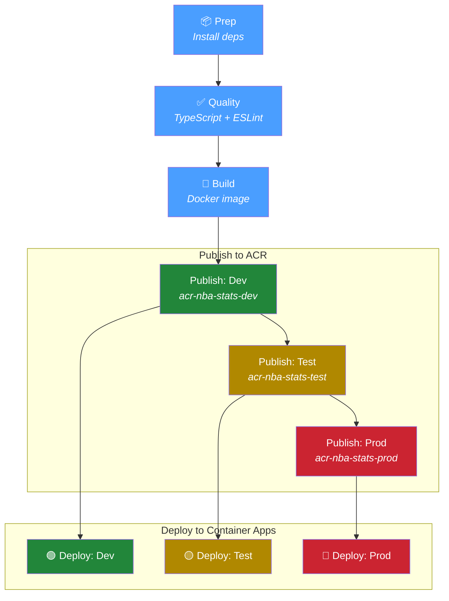
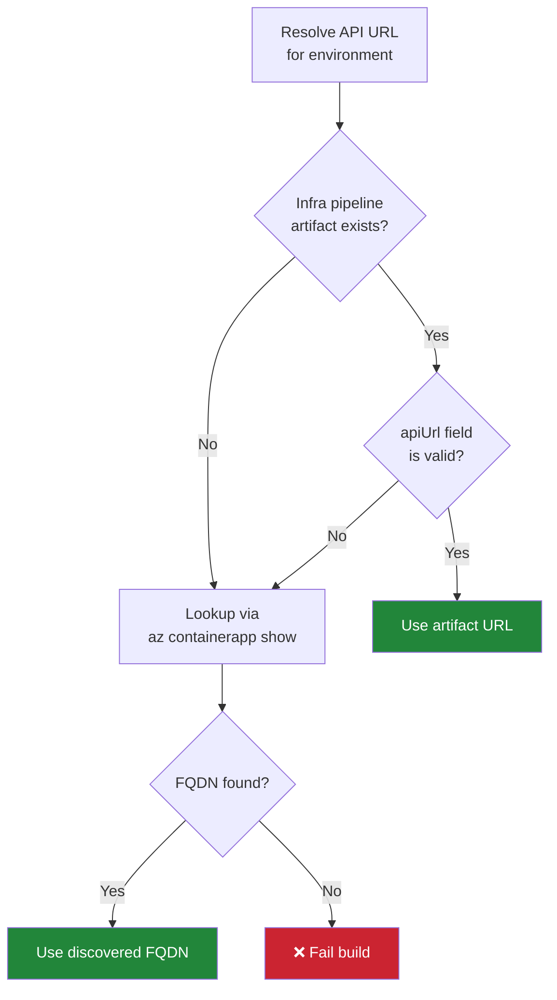
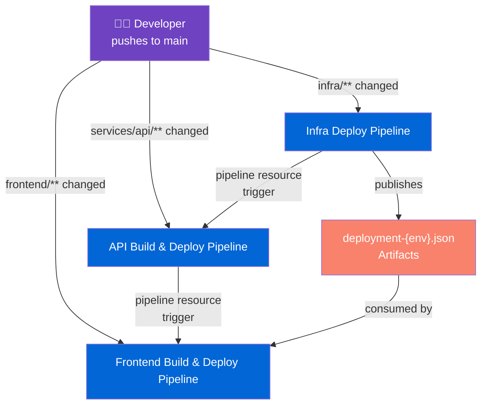
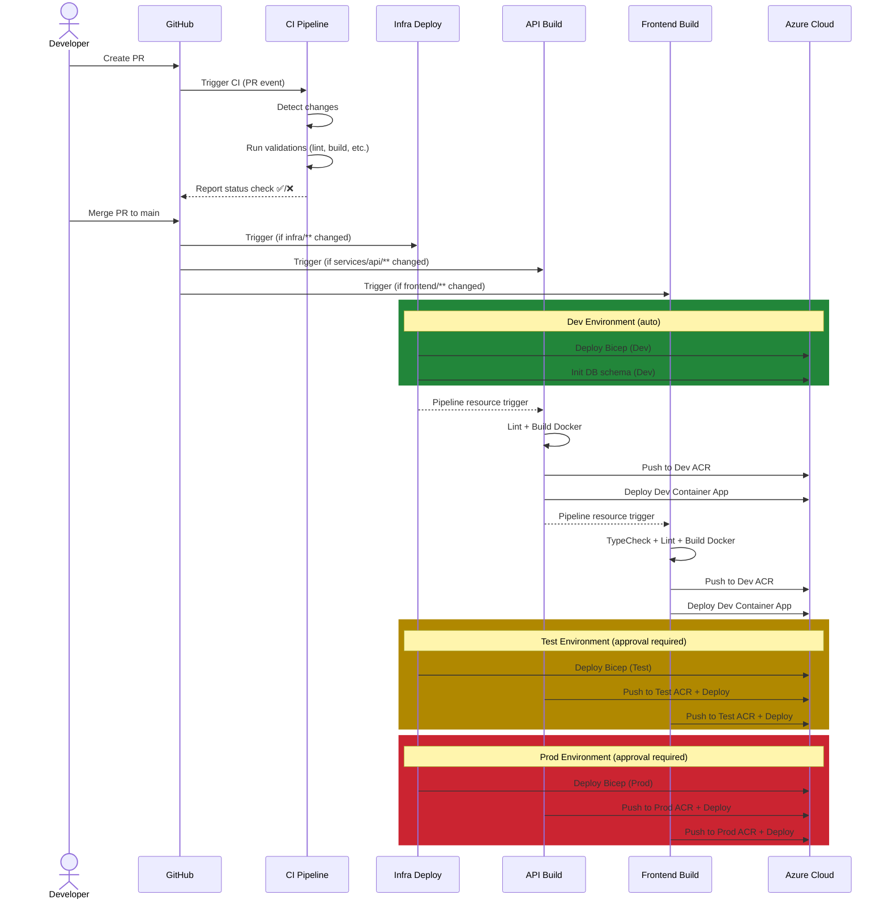
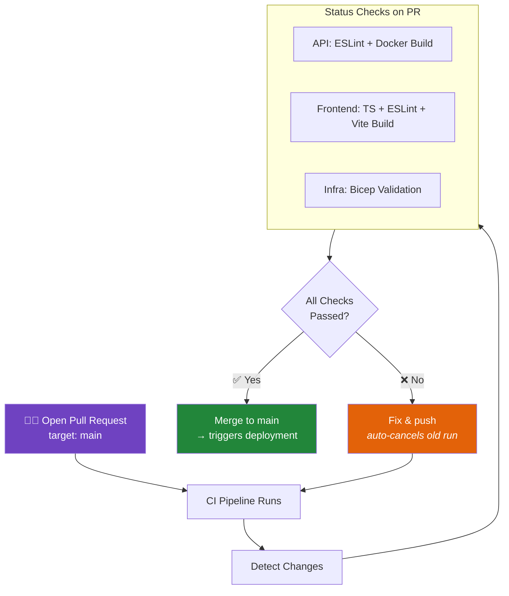
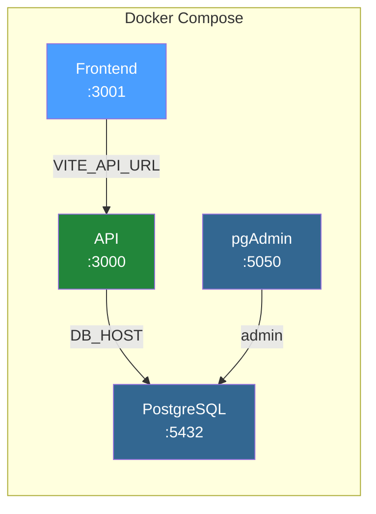

# NBA Stats — CI/CD Documentation

> **Platform:** Azure DevOps Pipelines • **Source:** GitHub (`codecurrent-sandbox/nba-stats`) • **Cloud:** Azure (Sweden Central)

---

## Table of Contents

- [High-Level Overview](#high-level-overview)
- [Environments](#environments)
- [Pipelines at a Glance](#pipelines-at-a-glance)
- [1. CI Pipeline — Continuous Integration](#1-ci-pipeline--continuous-integration)
- [2. Infrastructure Pipeline — Infra Deploy](#2-infrastructure-pipeline--infra-deploy)
- [3. API Pipeline — Build & Deploy](#3-api-pipeline--build--deploy)
- [4. Frontend Pipeline — Build & Deploy](#4-frontend-pipeline--build--deploy)
- [Pipeline Orchestration — Who Triggers Who](#pipeline-orchestration--who-triggers-who)
- [End-to-End Deployment Flow](#end-to-end-deployment-flow)
- [Pull Request Workflow](#pull-request-workflow)
- [Image Tagging Strategy](#image-tagging-strategy)
- [Docker Base Images](#docker-base-images)
- [Service Connections & Secrets](#service-connections--secrets)
- [Local Development](#local-development)

---

## High-Level Overview



---

## Environments

| Environment | Resource Group | Purpose | Approval Gate |
|---|---|---|---|
| **Dev** | `rg-nba-stats-dev` | Integration testing, early validation | None (auto-deploy) |
| **Test** | `rg-nba-stats-test` | QA, staging, pre-production testing | Environment approval |
| **Prod** | `rg-nba-stats-prod` | Live production workload | Environment approval |

Each environment contains:
- **Azure Container App** (API) — `nba-stats-{env}-api`
- **Azure Container App** (Frontend) — `nba-stats-{env}-frontend`
- **Azure Container Registry** — `acr-nba-stats-{env}`
- **Azure PostgreSQL Flexible Server** — with database `nba_stats`

---

## Pipelines at a Glance

| Pipeline | YAML File | Trigger | Purpose |
|---|---|---|---|
| **NBA-Stats-Continuous-Integration** | `pipelines/ci.yml` | PR + push to `main` | Validate code quality |
| **NBA-Stats-Infra-Deploy** | `pipelines/infra-deploy.yml` | Push to `main` (`infra/**`) | Deploy Azure infrastructure |
| **NBA-Stats-API-Deploy** | `pipelines/build-api.yml` | Push to `main` (`services/api/**`) + Infra pipeline completion | Build, publish & deploy API |
| **NBA-Stats-Frontend-Deploy** | `pipelines/build-frontend.yml` | Push to `main` (`frontend/**`) + API pipeline completion | Build, publish & deploy Frontend |

---

## 1. CI Pipeline — Continuous Integration

**File:** `pipelines/ci.yml`
**Build name:** `CI-{date}-{rev}`

The CI pipeline runs on every pull request and push to `main`. It uses a **smart change detection** mechanism to only validate areas that have changed.

### Triggers

| Event | Branches | Path Filters |
|---|---|---|
| Push | `main` | `services/api/**`, `frontend/**`, `infra/**`, `pipelines/**` |
| Pull Request | `main` | `services/api/**`, `frontend/**`, `infra/**`, `pipelines/**` |

### Stage Flow



### Change Detection Logic

The **Detect** stage runs `git diff` between `HEAD` and `origin/main` to determine which project areas have changed:

| Path Pattern | Output Variable | Stages Activated |
|---|---|---|
| `services/api/**` | `apiChanged` | API — ESLint, Docker Build |
| `frontend/**` | `frontendChanged` | Frontend — TypeScript, ESLint, Vite Build |
| `infra/**` | `infraChanged` | Infra — Bicep Validation |

### Jobs Detail

**API Validation** (parallel jobs):
- **ESLint** — `npm run lint` on the API codebase
- **Docker Build** — Validates the Dockerfile builds successfully (build only, no push)

**Frontend Validation** (sequential build after parallel checks):
- **TypeScript Check** — `npx tsc --noEmit` for type safety
- **ESLint** — `npm run lint` on the frontend codebase
- **Vite Build** — `npm run build` production build (runs after TypeScript + ESLint pass)

**Infrastructure Validation**:
- **Bicep Validation** — `az bicep build` + `az deployment sub what-if` against dev parameters

---

## 2. Infrastructure Pipeline — Infra Deploy

**File:** `pipelines/infra-deploy.yml`
**Build name:** `Infra-Deploy-{date}-{rev}`

Deploys Azure infrastructure using Bicep templates. This is the **first pipeline in the deployment chain** — it provisions the resources that the API and Frontend pipelines deploy to.

### Triggers

| Event | Branches | Path Filters |
|---|---|---|
| Push | `main` | `infra/**`, `pipelines/infra-deploy.yml` |
| Pull Request | `main` | `infra/**`, `pipelines/infra-deploy.yml` |

> **Note:** On pull requests, deployment stages are skipped (`condition: ne(variables['Build.Reason'], 'PullRequest')`)

### Stage Flow



### What Each Stage Does

1. **Deploy Bicep Template** — `az deployment sub create` with environment-specific parameters (`dev.bicepparam`, `test.bicepparam`, `prod.bicepparam`)
2. **Publish Deployment Outputs** — Saves deployment outputs (PostgreSQL FQDN, ACR name, API URL) as a pipeline artifact (`deployment-{env}.json`) for downstream pipelines
3. **Initialize Database Schema** — Runs `infra/scripts/init-database.sh` against the PostgreSQL server
4. **Tag Deployment** — Creates a git tag `infra-{env}-{buildNumber}` for traceability

### Deployment Artifacts

Each environment publishes a JSON artifact with key outputs:

```json
{
  "postgresServerFqdn": "...",
  "resourceGroupName": "rg-nba-stats-{env}",
  "containerRegistryName": "...",
  "containerRegistryLoginServer": "...",
  "apiUrl": "https://..."
}
```

These artifacts are consumed by the Frontend pipeline to resolve API endpoints.

---

## 3. API Pipeline — Build & Deploy

**File:** `pipelines/build-api.yml`
**Build name:** `API-Build-{date}-{rev}`

Builds the Node.js API Docker image and deploys it across all environments.

### Triggers

| Event | Source | Condition |
|---|---|---|
| Push | `main` branch | Path: `services/api/**`, `pipelines/build-api.yml` |
| Pull Request | `main` branch | Path: `services/api/**`, `pipelines/build-api.yml` |
| Pipeline Resource | `NBA-Stats-Infra-Deploy` completes on `main` | Automatic |

> **Key:** The Infra pipeline triggers the API pipeline via a `resources.pipelines` trigger. This ensures infrastructure is provisioned before deploying the API.

### Stage Flow



### Stage Details

| # | Stage | Condition | What It Does |
|---|---|---|---|
| 1 | **Prep** | Always | Install Node.js 20.x, `npm ci` with cache |
| 2 | **Quality** | After Prep | `npm run lint` (ESLint) |
| 3 | **Build** | After Quality | Build Docker image, tag as `{version}-{sha}` and `latest` |
| 4 | **Publish: Dev** | `main` branch only | Build & push to Dev ACR |
| 5 | **Publish: Test** | After Dev publish | Build & push to Test ACR |
| 6 | **Publish: Prod** | After Test publish | Build & push to Prod ACR |
| 7 | **Deploy: Dev** | After Dev publish | Update Container App image + DB connection string |
| 8 | **Deploy: Test** | After Test publish | Update Container App image + DB connection string |
| 9 | **Deploy: Prod** | After Prod publish | Update Container App image + DB connection string |

### Deploy Steps (per environment)

1. **Generate image tag** from `package.json` version + git SHA
2. **Update database connection string secret** — Discovers PostgreSQL FQDN via `az postgres flexible-server list`, constructs connection string, updates Container App secret
3. **Update Container App** — `az containerapp update` with the new image from ACR

---

## 4. Frontend Pipeline — Build & Deploy

**File:** `pipelines/build-frontend.yml`
**Build name:** `Frontend-Build-{date}-{rev}`

Builds the React/Vite frontend Docker image with the correct API URL baked in at build time, then deploys across all environments.

### Triggers

| Event | Source | Condition |
|---|---|---|
| Push | `main` branch | Path: `frontend/**`, `pipelines/build-frontend.yml` |
| Pull Request | `main` branch | Path: `frontend/**`, `pipelines/build-frontend.yml` |
| Pipeline Resource | `NBA-Stats-API-Deploy` completes on `main` | Automatic |

> **Key:** The API pipeline triggers the Frontend pipeline. Infrastructure triggers are set to `none` on the Frontend — it chains through the API pipeline instead.

### Stage Flow



### API URL Resolution

The Frontend build requires `VITE_API_URL` to be baked in at Docker build time. Each environment resolves the API URL through a fallback chain:



1. **Try pipeline artifact** — Downloads `deployment-{env}.json` from the latest Infra Deploy run
2. **Fallback to Azure CLI** — Queries `az containerapp show` for the API Container App's FQDN
3. **Fail** — If neither source resolves a URL, the build fails

---

## Pipeline Orchestration — Who Triggers Who



### Trigger Chains

| Scenario | What Happens |
|---|---|
| **Only infra changes** | Infra Deploy → triggers API Build → triggers Frontend Build |
| **Only API changes** | API Build & Deploy (direct trigger) → triggers Frontend Build |
| **Only frontend changes** | Frontend Build & Deploy (direct trigger only) |
| **All areas change** | All 3 pipelines run from direct triggers + the chain propagates |

### Why the Chain Exists

- **Infra → API**: Infrastructure must be provisioned before the API can deploy (ACR, Container Apps, PostgreSQL)
- **API → Frontend**: The Frontend needs the API URL at build time. When the API redeploys, the Frontend should rebuild to pick up any new API endpoint

---

## End-to-End Deployment Flow

This shows the complete lifecycle from code change to production for all components.



---

## Pull Request Workflow



### PR Behavior

- **Auto-cancel**: New pushes to a PR branch automatically cancel in-progress CI runs (`pr.autoCancel: true`)
- **Path-filtered**: Only relevant checks run — pushing only API changes won't trigger Frontend or Infra validation
- **No deployments**: Deployment pipelines skip their deploy stages on PRs (`condition: ne(variables['Build.Reason'], 'PullRequest')` or `eq(variables['Build.SourceBranch'], 'refs/heads/main')`)

---

## Image Tagging Strategy

Docker images are tagged with a combination of semantic version and git SHA for traceability:

```
{version}-{short-sha}
```

**Example:** `1.0.0-a3b4c5d`

| Component | Source | Example |
|---|---|---|
| `version` | `package.json` → `.version` | `1.0.0` |
| `short-sha` | `git rev-parse --short=7 HEAD` | `a3b4c5d` |

Every image is also tagged `latest` for convenience.

---

## Docker Base Images

All Docker images use **Microsoft Container Registry (MCR)** Azure Linux images to comply with the organization's Secure Supply Chain Analysis (SSCA) policy:

| Service | Build Stage | Runtime Stage |
|---|---|---|
| **API** | `mcr.microsoft.com/azurelinux/base/nodejs:20` | `mcr.microsoft.com/azurelinux/base/nodejs:20` |
| **Frontend** | `mcr.microsoft.com/azurelinux/base/nodejs:20` | `mcr.microsoft.com/azurelinux/base/nginx:1` |

### Azure Linux Notes

Azure Linux images use `tdnf` (not `apk` or `apt`). Some tools need explicit installation:

| Need | Solution |
|---|---|
| Process manager (`dumb-init`) | Download binary from [GitHub releases](https://github.com/Yelp/dumb-init/releases) |
| User management (`groupadd`, `useradd`) | `tdnf install -y shadow-utils` |
| HTTP client | `curl` is available; `wget` is not |

---

## Service Connections & Secrets

### Azure DevOps Service Connections

| Connection Name | Type | Used By |
|---|---|---|
| `azure-nba-stats-connection` | Azure Resource Manager | Infra, API, Frontend pipelines |
| `acr-nba-stats-dev` | Docker Registry (ACR) | API & Frontend publish stages |
| `acr-nba-stats-test` | Docker Registry (ACR) | API & Frontend publish stages |
| `acr-nba-stats-prod` | Docker Registry (ACR) | API & Frontend publish stages |

### Pipeline Variables / Secrets

| Variable | Used By | Purpose |
|---|---|---|
| `POSTGRES_ADMIN_PASSWORD` | Infra, API pipelines | PostgreSQL admin password (secret) |
| `NBA_API_KEY` | Infra pipeline | External NBA data API key (secret) |

### Azure DevOps Environments

| Environment | Pipelines | Approval |
|---|---|---|
| `nba-stats-dev` | Infra, API, Frontend | None |
| `nba-stats-test` | Infra, API, Frontend | Manual approval |
| `nba-stats-prod` | Infra, API, Frontend | Manual approval |

---

## Local Development

Local development uses `docker-compose.yml` to run the full stack:



```bash
# Start all services
docker compose up -d

# View logs
docker compose logs -f api

# Rebuild after changes
docker compose build api && docker compose up -d api
```

| Service | URL | Image |
|---|---|---|
| Frontend | `http://localhost:3001` | Built from `frontend/Dockerfile` |
| API | `http://localhost:3000` | Built from `services/api/Dockerfile` |
| PostgreSQL | `localhost:5432` | `postgres:15-alpine` |
| pgAdmin | `http://localhost:5050` | `dpage/pgadmin4:latest` |

> **Note:** Local dev uses Docker Hub images for PostgreSQL and pgAdmin (not MCR). The MCR requirement only applies to CI/CD-built images.
