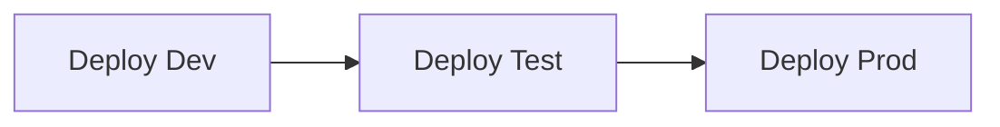

# NBA Stats - Infrastructure Documentation

This directory contains all Infrastructure as Code (IaC) for deploying the NBA Stats application to Azure using Bicep templates.

## Table of Contents

- [Overview](#overview)
- [Architecture](#architecture)
- [Deployment Methods](#deployment-methods)
- [Azure Resources](#azure-resources)
- [Environment Configuration](#environment-configuration)
- [Deployment Process](#deployment-process)
- [Troubleshooting](#troubleshooting)

## Overview

The infrastructure is designed with modern cloud-native practices:

- **Infrastructure as Code** - All resources defined in Bicep templates
- **Multi-Environment** - Separate configurations for Dev, Test, and Production
- **Automated Deployment** - Azure DevOps pipeline for CI/CD
- **Security Best Practices** - Managed identities, Key Vault, secrets management
- **Scalability** - Azure Container Apps with auto-scaling

## Architecture

```
Azure Subscription
│
├── Resource Group (rg-nba-stats-{env})
│   │
│   ├── Container Apps Environment
│   │   ├── Frontend Container App
│   │   └── API Container App
│   │
│   ├── Azure Container Registry
│   │   ├── Frontend Image
│   │   └── API Image
│   │
│   ├── Azure Database for PostgreSQL
│   │   └── nba_stats database
│   │
│   ├── Azure Key Vault
│   │   ├── NBA-API-Key (secret)
│   │   └── Postgres-Password (secret)
│   │
│   ├── Log Analytics Workspace
│   │   └── Container Apps logs
│   │
│   └── Managed Identity
│       └── Used by Container Apps to access Key Vault
```

## Deployment Methods

### 1. Azure DevOps Pipeline (Recommended)

The automated pipeline deploys to all three environments in sequence:



**Pipeline Features:**
- Automatic deployment on infrastructure changes
- Manual approval gates for Test and Prod
- Database initialization included
- Deployment tagging for tracking

**Location:** `/pipelines/infra-deploy.yml`

**Trigger:** Commits to `main` branch that modify files in `/infra/**`

**Stages:**
1. **Deploy Dev** - Automatically deploys to development
2. **Deploy Test** - Requires manual approval, deploys to test
3. **Deploy Prod** - Requires manual approval, deploys to production

### 2. Manual Deployment (Azure CLI)

For direct control or local testing:

```bash
# Login to Azure
az login

# Deploy using the script
./scripts/deploy.sh <environment>

# Examples:
./scripts/deploy.sh dev
./scripts/deploy.sh test
./scripts/deploy.sh prod
```

## Azure Resources

### Resource Naming Convention

All resources follow the naming pattern: `{resource-type}-nba-stats-{environment}`

**Example:**
- Resource Group: `rg-nba-stats-dev`
- Container Registry: `acrnbastatsdev`
- Key Vault: `kv-nba-stats-dev-xyz123`
- Database: `psql-nba-stats-dev`

### Resource Details

#### 1. Container Apps Environment
- **Purpose:** Hosting environment for containerized applications
- **Features:** 
  - Managed Kubernetes infrastructure
  - Auto-scaling based on HTTP traffic
  - Built-in ingress controller
- **Configuration:**
  - Dev: 1-3 replicas
  - Test: 2-5 replicas
  - Prod: 2-10 replicas

#### 2. Azure Container Registry (ACR)
- **Purpose:** Store Docker images for frontend and API
- **SKU:** Basic (sufficient for small workloads)
- **Admin Access:** Enabled for simplified container app deployment
- **Images:**
  - `frontend:latest` - React application
  - `api:latest` - Node.js Express API

#### 3. Azure Database for PostgreSQL
- **Purpose:** Primary data store for NBA statistics
- **Configuration:**
  - Dev: `Standard_B1ms` (1 vCore, 2GB RAM, 32GB storage)
  - Test: `Standard_D2ds_v4` (2 vCores, 8GB RAM, 64GB storage)
  - Prod: `Standard_D2ds_v4` (2 vCores, 8GB RAM, 128GB storage)
- **Network:** 
  - Public access enabled for Azure services
  - Firewall rules for Azure DevOps agents
- **Database:** `nba_stats` (auto-created during deployment)
- **Schema:** Initialized via `/infra/scripts/init-database.sh`

#### 4. Azure Key Vault
- **Purpose:** Secure storage for secrets and API keys
- **Secrets:**
  - `NBA-API-KEY` - BallDontLie API key
  - `POSTGRES-PASSWORD` - Database admin password
- **Access:** Managed Identity assigned to Container Apps
- **SKU:** Standard

#### 5. Log Analytics Workspace
- **Purpose:** Centralized logging and monitoring
- **Retention:** 30 days
- **Data Sources:**
  - Container Apps stdout/stderr
  - Application logs
  - Infrastructure metrics

#### 6. Managed Identity
- **Type:** User-assigned
- **Purpose:** Passwordless authentication between services
- **Permissions:**
  - Key Vault Secrets User (read secrets)
  - ACR Pull (pull container images)

## Environment Configuration

### Parameter Files

Each environment has its own parameter file in `/parameters/`:

```
parameters/
├── dev.bicepparam      # Development environment
├── test.bicepparam     # Testing environment
└── prod.bicepparam     # Production environment
```

### Environment Differences

| Parameter | Dev | Test | Prod |
|-----------|-----|------|------|
| **Database SKU** | Standard_B1ms | Standard_D2ds_v4 | Standard_D2ds_v4 |
| **Database Storage** | 32 GB | 64 GB | 128 GB |
| **Min Replicas** | 1 | 2 | 2 |
| **Max Replicas** | 3 | 5 | 10 |
| **Zone Redundancy** | Disabled | Disabled | Disabled |
| **Private Endpoints** | Disabled | Disabled | Disabled |

### Required Parameters

The following parameters must be provided during deployment:

1. **postgresAdminPassword** - PostgreSQL admin password
   - Min 8 characters
   - Must contain uppercase, lowercase, and numbers
   - Set as pipeline secret variable `POSTGRES_ADMIN_PASSWORD`

2. **nbaApiKey** - BallDontLie API key
   - Get from https://www.balldontlie.io
   - Set as pipeline secret variable `NBA_API_KEY`

3. **location** - Azure region (default: `swedencentral`)

## Deployment Process

### What Happens During Deployment

#### 1. Infrastructure Provisioning
```bash
az deployment sub create \
  --name "deploy-{env}-{build-number}" \
  --location "swedencentral" \
  --template-file "infra/main.bicep" \
  --parameters "infra/parameters/{env}.bicepparam"
```

**Creates:**
- Resource group
- All Azure resources (ACR, PostgreSQL, Key Vault, etc.)
- Managed identity and role assignments
- Secrets in Key Vault

**Duration:** ~5-8 minutes

#### 2. Database Initialization
```bash
./infra/scripts/init-database.sh \
  --server "{postgres-fqdn}" \
  --database "nba_stats" \
  --username "nbastatsadmin" \
  --password "{password}"
```

**Actions:**
- Creates database schema
- Creates tables: teams, players, games
- Sets up indexes
- Runs migrations

**Duration:** ~30 seconds

#### 3. Deployment Tagging
```bash
git tag -a "infra-{env}-{build-number}" \
  -m "Infrastructure deployment to {env} - {build-number}"
```

**Purpose:**
- Track deployments
- Enable rollback capabilities
- Audit trail

### Pipeline Variables

Set these as secret variables in Azure DevOps:

| Variable | Type | Description |
|----------|------|-------------|
| `POSTGRES_ADMIN_PASSWORD` | Secret | PostgreSQL admin password |
| `NBA_API_KEY` | Secret | BallDontLie API key |

### Manual Approval Gates

- **Dev:** No approval required (auto-deploys)
- **Test:** Manual approval required in Azure DevOps environment
- **Prod:** Manual approval required in Azure DevOps environment

## Troubleshooting

### Common Issues

#### Issue: Deployment fails with "Key Vault name not available"

**Cause:** Key Vault names must be globally unique

**Solution:**
```bash
# Key Vault names are auto-generated with random suffix
# If deployment fails, the pipeline will retry with a new suffix
# No action needed - pipeline handles this automatically
```

#### Issue: Database initialization fails

**Cause:** PostgreSQL firewall blocking Azure DevOps agent

**Solution:**
1. Ensure `publicNetworkAccess` is enabled in Bicep template
2. Verify firewall rules allow Azure services
3. Check that `init-database.sh` has execute permissions

```bash
chmod +x infra/scripts/init-database.sh
```

#### Issue: Container Apps can't pull images

**Cause:** Managed identity doesn't have ACR pull permissions

**Solution:**
```bash
# Verify role assignment exists
az role assignment list \
  --assignee <managed-identity-principal-id> \
  --scope <acr-resource-id>

# If missing, add role:
az role assignment create \
  --assignee <managed-identity-principal-id> \
  --role "AcrPull" \
  --scope <acr-resource-id>
```

#### Issue: Secrets not accessible from Container Apps

**Cause:** Managed identity doesn't have Key Vault permissions

**Solution:**
```bash
# Add Key Vault Secrets User role
az role assignment create \
  --assignee <managed-identity-principal-id> \
  --role "Key Vault Secrets User" \
  --scope <key-vault-resource-id>
```

### Validate Deployment

After deployment completes, verify resources:

```bash
# List all resources in resource group
az resource list \
  --resource-group rg-nba-stats-dev \
  --output table

# Check Container Apps status
az containerapp list \
  --resource-group rg-nba-stats-dev \
  --query "[].{Name:name, Status:properties.runningStatus}" \
  --output table

# Test database connectivity
psql "host=psql-nba-stats-dev.postgres.database.azure.com \
      dbname=nba_stats \
      user=nbastatsadmin \
      sslmode=require"
```

### View Deployment Logs

**Azure DevOps Pipeline:**
1. Navigate to Azure DevOps project
2. Go to Pipelines → NBA-Stats-Infra-Deploy
3. Select the build run
4. View logs for each stage

**Azure Portal:**
1. Navigate to Resource Group
2. Go to Deployments
3. Select the deployment
4. View deployment operations and errors

## File Structure

```
infra/
├── main.bicep                          # Main orchestration template
├── parameters/
│   ├── dev.bicepparam                  # Dev environment config
│   ├── test.bicepparam                 # Test environment config
│   └── prod.bicepparam                 # Prod environment config
├── modules/
│   ├── container-apps/
│   │   ├── api-app.bicep              # API Container App
│   │   ├── environment.bicep          # Container Apps Environment
│   │   └── frontend-app.bicep         # Frontend Container App
│   ├── database/
│   │   └── postgres.bicep             # PostgreSQL Flexible Server
│   ├── identity/
│   │   └── managed-identity.bicep     # User-assigned identity
│   ├── monitoring/
│   │   ├── alerts.bicep               # Alert rules
│   │   └── log-analytics.bicep        # Log Analytics workspace
│   ├── registry/
│   │   └── container-registry.bicep   # Azure Container Registry
│   └── secrets/
│       └── key-vault.bicep            # Azure Key Vault
├── scripts/
│   ├── deploy.sh                      # Manual deployment script
│   └── init-database.sh               # Database initialization
├── docs/
│   └── SERVICE_CONNECTION.md          # Azure DevOps setup guide
└── README.md                          # This file
```

## Additional Resources

- [Azure Bicep Documentation](https://learn.microsoft.com/azure/azure-resource-manager/bicep/)
- [Azure Container Apps Documentation](https://learn.microsoft.com/azure/container-apps/)
- [Azure Database for PostgreSQL](https://learn.microsoft.com/azure/postgresql/)
- [Azure DevOps Pipelines](https://learn.microsoft.com/azure/devops/pipelines/)

## Support

For issues or questions:
1. Check this README and troubleshooting section
2. Review deployment logs in Azure DevOps
3. Check Azure Portal for resource status
4. Review Bicep template documentation
